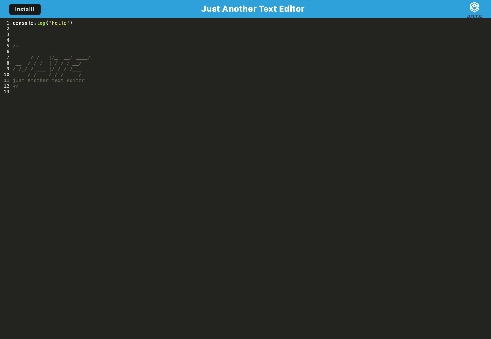

# Text-Editor

  

  ## Description
  Just a simple text editor.

  ## Table of Contents
  - [Installation](#installation)
  - [License](#license)
  - [Credits](#credits)
  - [Questions](#questions)

  ## Installation 
   - Use this <a href="https://text-editor-67em.onrender.com">LINK</a> then click the install button in top left of browser.

  ## License
  

  ## Credits
  - ChatGPT
  - Xpert Learning Assistant
  - <a href="https://github.com/coding-boot-camp/cautious-meme">Starter code</a>.

  ## Questions
  If you have questions, you can contact me at [cimarron13@mac.com](mailto:cimarron13@mac.com) or <a href="https://github.com/cjenschke">GitHub</a>.